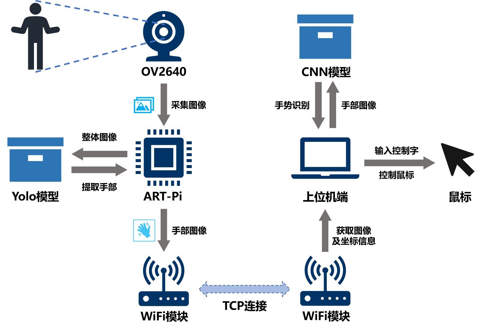
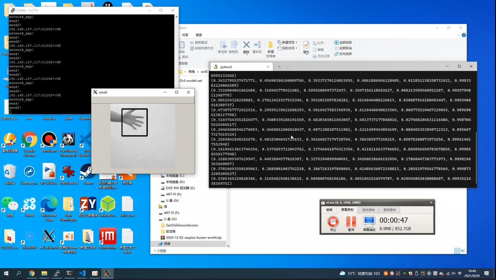
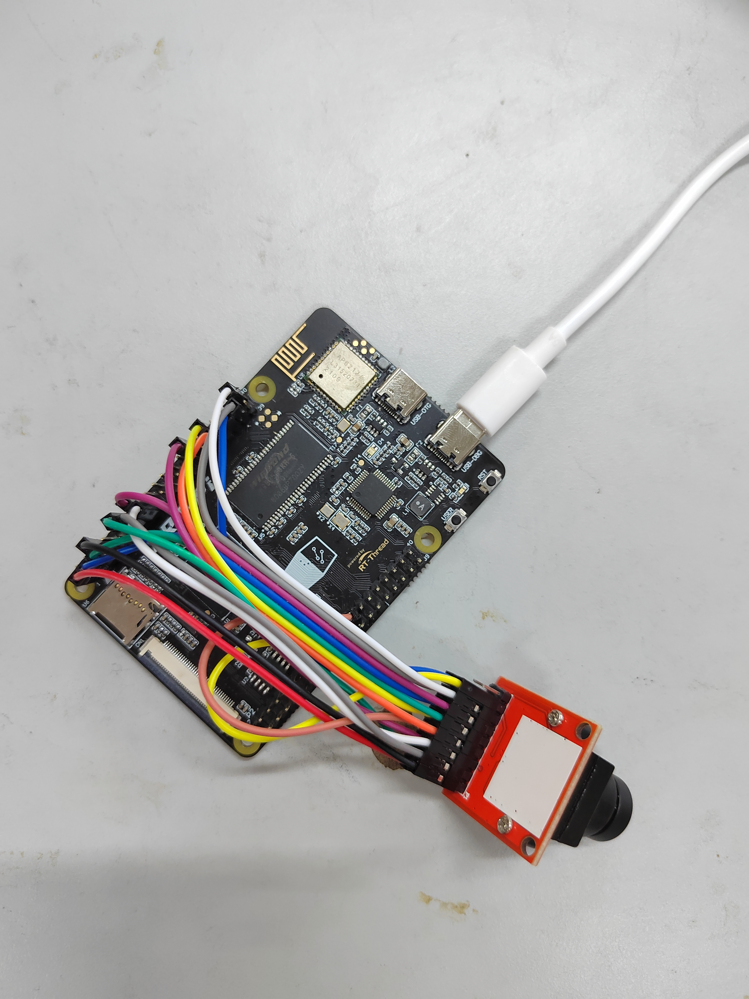
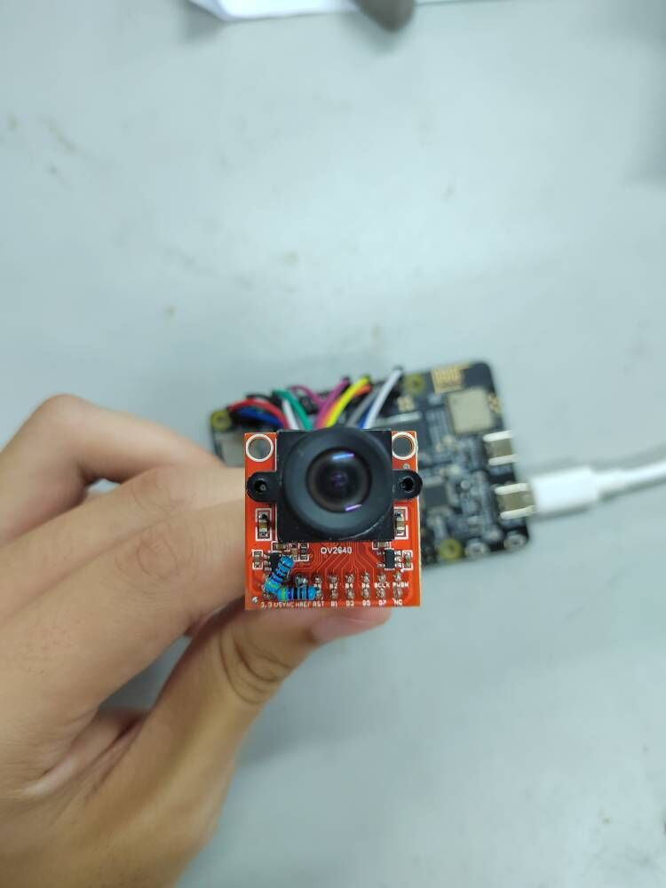
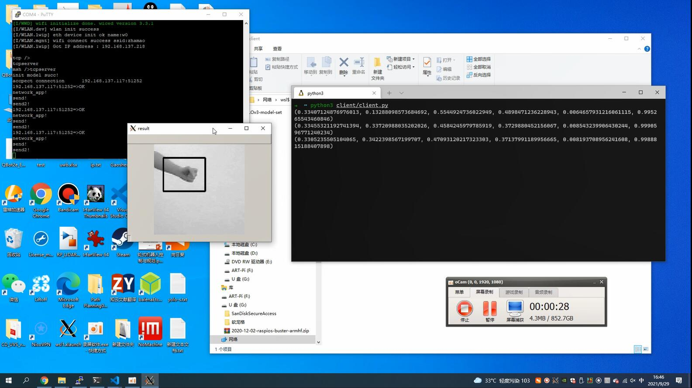

# ART-PI手势识别

## 简介

本项目基于 [Yolo-Fastest]()，进一步缩小网络，并部署到``ART-PI``上。通过TCP实现图像和信息的传输。具体可以参考WIFI 例程。
系统的整体框图为：


效果：



## 硬件说明

使用OV2640作为摄像头，但是请注意购买的摄像头I2C需要有**上拉电阻**，ART-PI的模拟I2C没有上拉电阻，开启内部上拉也不好使。


下图为加了两个上拉电阻的OV2640。


## 软件说明

本项目实现了摄像头数据的读取以及小型化yolo在ART-PI上的部署，可以作为您其他AI相关应用的基础工程。如有帮助请不要吝啬你的⭐star⭐！

## 运行
### 编译&下载

编译完成后，将开发板的 ST-Link USB 口与 PC 机连接，然后将固件下载至开发板。

### 运行板子程序

首先需要连接到wifi：

```shell
wifi join [ssid] [password]
```

然后开启``tcpserver``，板子就会在``[ip]:5000``这个端口上发送图片和相关推理信息:

```shell
tcpserver
```

### 上位机程序

我不给

### 运行效果


## 注意事项

偶尔 ``hard fault`` ，重启一下板子就好了。

垃圾代码，**junk code dont read** 。
